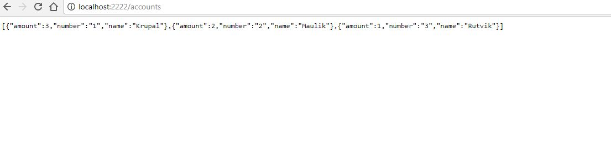

# accounts-microservice-server
> Day 2 - Spring Boot - Accounts Micro Service Data Provider

### Description
In these project all backend side work of database managed and provided like Restful web services.
##### Link
> http://localhost:2222/accounts
> http://localhost:2222/accounts/3


## Screenshot



## To Create JAR

```sh
mvn clean package
```


## To Run JAR

```sh
java -jar target/com.rutvikpatel.ms.accounts-microservice-server-0.0.1-SNAPSHOT.jar
```


## Meta

Rutvik Patel - rrpatel003@gmail.com

Distributed under the GPL V3.0 license. See ``LICENSE`` for more information.
